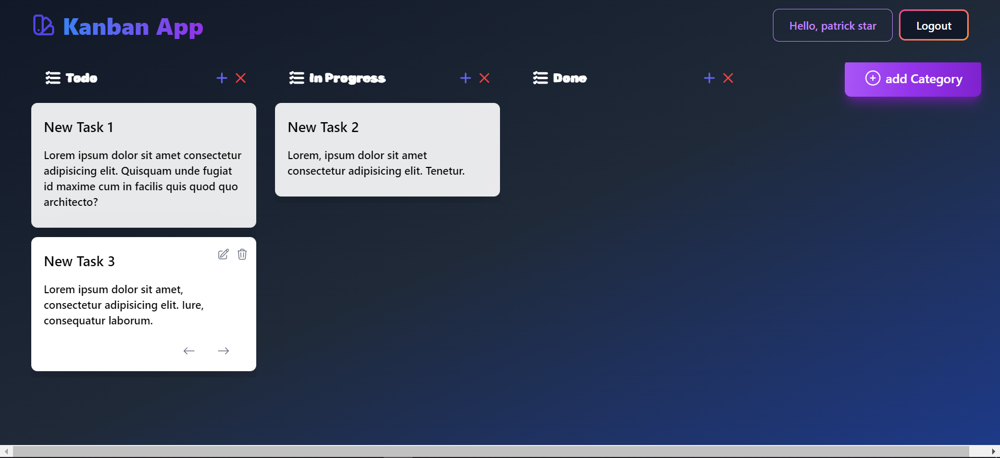

## Kanban App

### Description

A Kanban app is a simple tool that allows users to manage their work using the Kanban method. Kanban is a project management method that uses a board to visualize the progress of tasks. This app allows you to create a kanban board with columns for each category of your workflow, and cards for each task. You can easily add, edit, and move cards between columns to keep track of the status of your tasks.

### Features

- Register user
- Login user
- Logout
- Create Category
- Delete Category
- Create Task
- Update Task
- Delete Task
- Move Task (from one category to another)

### Constraints

There are several constraint that exist in this application:

- There are 2 different applications in one project, web applications and REST API applications.
- This applications built using the golang mux package for routing and handling HTTP requests.
- The app's frontend styled using Tailwind CSS.
- This application uses the PostgreSQL database.
- Applications use cookies for authentication (still very vuln), we can use JWT to be more secure.

### Folder Structure

- Main.go: is the entry point program or the file that is first run by the program, specifically in the `init()` and `main()` functions. This file contains the setup of various configs, as well as the registration of instances of each layer, such as the `repository`, `service`, and `handler`. On the other hand, all endpoints are also routed in this file using the mux server in golang.
- config: is a folder used to prepare the project config.
- entity: is a folder used to store all the models that will be used in the data exchange in each layer.
- handler: functions as the handler for each endpoint. This folder will be divided into two more folders, `api` and `web`. The `api` folder handles requests on the backend. Meanwhile, the `web` folder handles requests from the frontend, such as parsing HTML to display web pages using the [template](https://pkg.go.dev/text/template) package in golang, and some endpoint handlers to handle processes on form actions.
- middleware: is a layer that functions to handle all user requests before they enter the handler. This layer will handle the authentication process such as checking cookies and limiting HTTP methods on each endpoint.
- service: is a folder that contains the business logic of the project. This layer will be called in the `handler/api`.
- client: is a folder used in the `handler/web` layer to make requests to the backend _(handler/api)_ using the [net/http](https://pkg.go.dev/net/http) package in golang.
- repository: is a layer that will communicate directly with the PostgreSQL database using the [GORM](https://gorm.io/) ORM. This layer will be called in the `service`.
- utils: contains some logic that does not belong to the previous layers.
- views: is a folder that stores the HTML source code that will be displayed on the website.

### Disclaimer

This project is far from perfect and there is always room for improvement. If you would like to contribute, please feel free to fork this repository and submit a pull request. Your contributions are welcome and appreciated.

### UI

- Index
  
- Regis
  
- Login
  
- Dashboard
  
- Add Category
  
- Add Task
  
- Update Task
  
